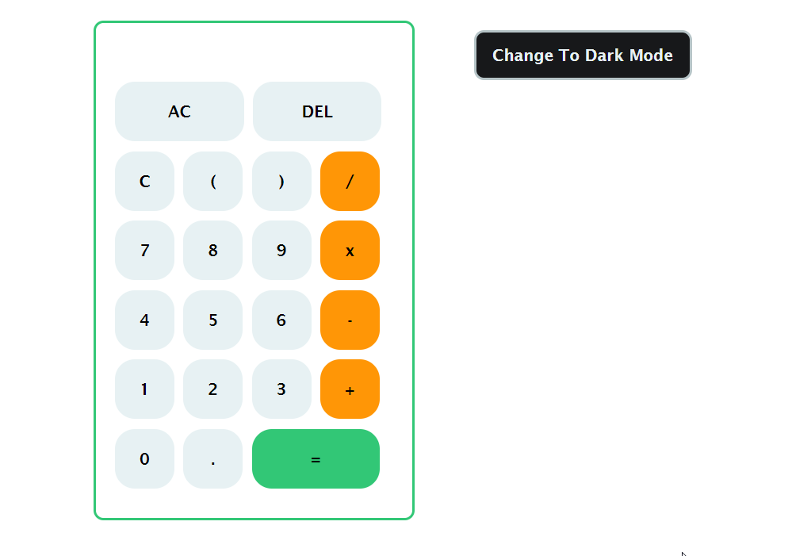

# Simple-Calculator
The most simple mathematical operations: addition, subtraction, multiplication, division. This is a simplified version of the online calculator.
Coded Using JavaScript, Html, CSS

